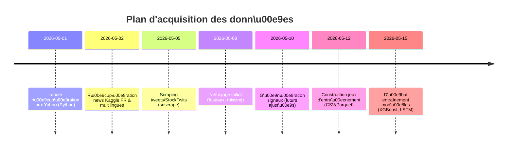

# Résumé exécutif

Pour entraîner un modèle de décision **achat/vente** à partir de données historiques de marché et d’actualité financière, il faut réunir plusieurs types de données (prix de marché, news, réseaux sociaux, rapports financiers) et générer des signaux (labels) à partir de celles-ci. Nous recommandons d’abord de privilégier les sources **ouvertes et gratuites** : par exemple, les API Yahoo Finance, Alpha Vantage pour les prix, et des corpus de news financiers (ex. FNSPID, Kaggle) pour le texte. Chaque source se caractérise par son période couverte, sa fréquence (quotidienne, minute, tick), son format (CSV, JSON, API), son coût/licence, etc.

Ensuite, on télécharge et convertit ces données en un format unique (CSV/Parquet) puis on crée une base de données (SQLite/Postgres) pour aligner prix et news. Pour générer les labels buy/sell, on peut appliquer des règles classiques (e.g. `signal = BUY si le rendement futur (>H jours) dépasse un seuil, SELL sinon si rend fut < -seuil`). Cela se fait par SQL Window Functions ou en Pandas. On prend soin de gérer les *événements* (dividendes, splits, résultats) soit via des sources dédiées (e.g. EDGAR/Alpha Vantage Corporate), soit via ajustement des prix. 

Avant l’entraînement, il faut prétraiter : normaliser les fuseaux horaires (tout en UTC), remplir les données manquantes (ex. forward-fill), rééchantillonner sur des pas identiques (daily, intraday), et nettoyer le texte (suppression HTML/punctuation). Pour le texte on utilisera des embeddings modernes (BERT, CamemBERT pour le français) ou TF-IDF. Ensuite, on construira des *features* mixtes (prix+sentiment) pour entraîner des modèles (XGBoost, LSTM, Transformer, ou modèles hybrides texte+prix). 

Plusieurs *benchmarks* existent : par exemple, sur le corpus StockNet (tweets+prix) les auteurs rapportent ~74–78% de F1 en prédiction binaire【25†L71-L79】. Il est courant d’évaluer à la fois en métriques de classification (accuracy, F1, précision@k) et financières (Profit cumulé, ratio de Sharpe). On comparera plusieurs approches : XGBoost sur features statistiques, RNN/Transformer sur séries temporelles, et modèles multimodaux combinant texte et données de prix.

Enfin, la pipeline idéale comprend une base de données unifiée (tables `prices`, `news`, `signaux`), une phase ETL pour remplir ces tables, un module d’entraînement (PyTorch/HuggingFace pour le texte, scikit-learn pour les techniques classiques), et un module de backtest pour mesurer le PnL et les risques. On peut illustrer cela via un graphique global (voir diagramme mermaid ci-dessous) et planifier les étapes d’acquisition des données dans un planning. 

En résumé, nous préconisons de commencer par des jeux gratuits : **Yahoo Finance** et **Alpha Vantage** pour les prix【4†L625-L632】, **FNSPID** ou **financial-news-multisource** (Hugging Face) pour les news【10†L261-L270】【13†L170-L178】, et le dataset Kaggle “French financial news” pour du français【17†L39-L45】. On complétera par des sources sociales (StockTwits, Twitter via snscrape) et EDGAR pour les événements d’entreprise. Le processus ETL et de labélisation sera automatisé en Python (exemples ci-dessous), puis on entraînera différents modèles (tableau comparatif ci-dessous) en suivant un pipeline complet (mermaid flow). Ce document présente en détail chaque catégorie de données, les moyens de les récupérer/convertir, les méthodes de labellisation, le prétraitement et l’architecture d’entraînement recommandée. 

# 1. Sources de données historiques

| **Type**        | **Source (Libre)**                   | **Période**       | **Fréquence**   | **Accès**                 | **Format**    | **Coût/Licence**        | **Volume**  | **Usage**                               |
| -------------- | ------------------------------------- | ----------------- | --------------- | ------------------------- | ------------ | ----------------------- | ----------- | --------------------------------------- |
| **Prix (actions)**    | Yahoo Finance【4†L627-L629】         | Depuis ~1960       | Journalière (historique), intraday limité | API / CSV par `yfinance`【4†L627-L629】   | CSV/JSON       | Gratuit, CC0            | Milliers de tickers,  decennies | Historique complet (ajusté splits/dividendes) |
|                | Alpha Vantage【4†L625-L632】          | Depuis ~1998       | Journalière/5min        | API (clé gratuite)        | JSON/CSV      | Gratuit (limité 5 req/min) | Quelques dizaines M de quotes | Stocks USA, Forex, Crypto, Indicateurs techniques |
|                | IEX Cloud                            | Depuis 2000        | Journalière/Intraday    | API (clé gratuite limitée)| JSON         | Gratuit limit up 50k calls/mois | 10-20 M points            | Stocks USA (proxy Nasdaq), bid/ask avancé |
|                | Tiingo (free tier)                   | Depuis 2000        | Journalière            | API (key gratuite)        | JSON/CSV      | Gratuit (limité)        | (Semi-)annuel par ticker     | Stocks US, Crypto, news sentiment basique |
|                | Kaggle “Stock Market Dataset”【23†】  | Jusqu'en 2021      | Journalière            | CSV (1 fichier)           | CSV           | CC0 (généralement)      | ~1GB (tous tickers NASDAQ)  | Pacquet historique (Tous NASDAQ)       |
| **Prix (crypto)**   | CryptoCompare / Binance API        | Depuis 2014        | Intraday (sec/min)     | API JSON (clé)            | JSON         | Gratuit (limité)       | Très gros (tick)            | Crypto (BTC, ETH, altcoins)             |
| **Niveaux ordre (ordre/tick)** | *Lobster* (recherche)      | 2007-     | Tick (millisecondes)    | Téléchargement (CSV)      | CSV          | Freely available (UT Austin) | Milliards de lignes         | Profondeur marché (US Large Caps)       |
| **Indices macro / économiques** | FRED (St-Louis Fed)【4†L643-L647】   | Depuis 1930s       | Mensuelle/quotidienne  | API / CSV                 | CSV           | Gratuit (Public Domain)   | Giga scales (fact sheets)  | Indicateurs éco, taux, currencies       |
| **Données fondamentales** | Yahoo Finance (Bilan, BNA)【4†L627-L629】 | Depuis 2000s       | Trimestrielle/annuelle  | API (via `yfinance`)     | JSON         | Gratuit                | ~10k sociétés           | Bilan, CA, dette, PER…                   |
|                | Alpha Vantage Fundamentals【4†L625-L632】   | + à partir 2017   | Trimestrielle/annuelle  | API (clé)                 | CSV/JSON      | Gratuit (limité)       | Importants (US,Europe)    | Ratios financiers, bilans                |
| **News financières** | FNSPID【10†L261-L270】             | 1999–2023 (S&P500) | Variable (journalier)    | HuggingFace (Parquet)     | Parquet       | CC BY-NC (non-commercial) | 15,7M articles, 29,7M prix【10†L261-L270】 | News + prix S&P500 (USA) (4 sources)    |
|                | “Financial News Multisource”【13†L170-L178】 | 1990–2025         | Journalier            | HuggingFace (Parquet)     | Parquet       | License recherche non-commercial | 57M+ articles           | Agrégation 24 datasets (Benzinga, Reuters, etc) |
|                | Kaggle “French Financial News”【17†L39-L45】  | 11/2018–03/2021   | Quotidienne? (75/jour) | CSV                      | CSV           | CC0-1.0 (Public Domain)  | 42k lignes (~69MB)          | News FR (CAC40) avec traduction & sentiment VADER【17†L39-L45】 |
|                | Yahoo Finance RSS / News API       | Depuis 2008        | Temps réel/quotidien   | RSS/JSON (no auth)        | JSON/RSS      | Gratuit                | Modéré (quelques K/j)       | News headlines/actions                    |
|                | Finnhub News API                   | Depuis 2018        | Temps réel/quotidien   | API (clé gratuite)        | JSON         | Gratuit (limité)       | ~100k/jours               | News + sentiment (AlphaSense & autres)    |
|                | Benzinga News (via API ou Kaggle)  | Depuis 2010        | Journalier (min/min)   | API (clé payante)        | JSON         | Payant (plans payants) | ~1M articles               | News business, analystes                   |
|                | *Autres (RSS, fil Twitter finance)*   | –                 | –                     | –                         | –             | –                     | –                           | GoogleNews API, Reddit r/finance (via Pushshift), etc. |

Les sources gratuites citées ci-dessus fournissent déjà l’essentiel des données nécessaires【4†L625-L632】【17†L39-L45】【10†L261-L270】. Les données payantes (Bloomberg, Reuters, FactSet, RavenPack) offrent plus de richesse (business wire, revue analyste, sentiment calibré) mais sont hors budget typique _desktop_. 

# 2. Récupération et conversion des données

Pour chaque source, voici comment récupérer les données (exemples en Python) et les convertir en format exploitable (CSV/Parquet):

- **Yahoo Finance (prix historiques)** – Utiliser la bibliothèque `yfinance` (sans clé API) ou `pandas-datareader`:

```python
!pip install yfinance
import yfinance as yf
# Télécharger historiques quotidiens de plusieurs ticker sur 10 ans
tickers = ["AAPL", "MSFT", "GOOG"]
df = yf.download(tickers, start="2010-01-01", end="2025-12-31", interval="1d", group_by='ticker')
# Format CSV ou Parquet
df.to_csv("prices_yahoo.csv")
```

Ceci donne un CSV avec les colonnes [Date, Ticker, Open, High, Low, Close, Adj Close, Volume]. Yahoo ajuste déjà les prix selon splits/dividendes. (Voir doc YFinance). Cette source couvre globalement tous les tickers cotés【4†L627-L629】.

- **Alpha Vantage (stocks, Forex, cryptos)** – API par clé. Exemple pour actions US (Output JSON converti en DataFrame):

```python
!pip install alpha_vantage pandas
from alpha_vantage.timeseries import TimeSeries
ts = TimeSeries(key='VOTRE_CLÉ', output_format='pandas')
data, meta = ts.get_daily(symbol='AAPL', outputsize='full')
data.to_csv("prices_alpha.csv")
```

Limitations : 5 requêtes/min. On peut itérer sur une liste de symboles. On récupère OHLC + volumes【4†L625-L632】. Alpha Vantage fournit aussi des endpoints de RSI/MACD, etc.

- **IEX Cloud (US équities)** – API REST (gratuit 50k calls/mois). Exemple via la librairie `requests` ou `iexfinance`:

```python
!pip install iexfinance
from iexfinance.stocks import Stock
from datetime import date
symbol = "IBM"
stock = Stock(symbol, token="YOUR_IEX_TOKEN")
ohlc = stock.get_chart(range='5y')
ohlc_df = pd.DataFrame(ohlc)
ohlc_df.to_csv("prices_iex_{}.csv".format(symbol))
```

Donne des timestamps (intraday minutes s’il y a, ou daily). Nécessite un token.

- **Kaggle (datasets statiques)** – On peut utiliser l’API Kaggle ou les notebooks Kaggle pour télécharger les fichiers CSV complets. Par exemple, pour le jeu *“Massive-stock-news”* ou *“Multi-channel stock dataset”*, il faut avoir `kaggle.json` et faire :

```bash
kaggle datasets download -d miguelaenlle/massive-stock-news-analysis-db-for-nlpbacktests
unzip massive-stock-news-analysis-db-for-nlpbacktests.zip -d ./data/news
```

Ensuite lire le CSV avec pandas. C’est souvent plus volumineux, mais on dispose d’une base préassemblée. Par exemple Kaggle *Stock Market Dataset* (NASDAQ) ou *Daily Financial News* peuvent être chargés ainsi.

- **FNSPID (Hugging Face)** – Ce jeu de données colossale (29.7M quotes + 15.7M news) est accessible via la librairie `datasets` de Hugging Face :

```python
!pip install datasets
from datasets import load_dataset
fnspid = load_dataset("Zihan1004/FNSPID", split="stock_news")
# Exporte en CSV
fnspid.to_pandas().to_csv("fnspid_news.csv", index=False)
```

Il existe plusieurs “split” (stock_prices et stock_news). Les instructions sur HuggingFace indiquent les commandes `wget` pour obtenir directement les fichiers zip【10†L307-L313】.

- **French financial news (Kaggle)** – Le Kaggle “French Financial News” (arcticgiant) propose deux CSV : `FrenchNews.csv` (41k news FR) et `FrenchNewsDayConcat.csv` (agrégation par jour)【17†L39-L45】. On télécharge via Kaggle CLI ou UI. Puis, par exemple :

```python
import pandas as pd
df_news = pd.read_csv("FrenchNews.csv")
print(df_news.head())
# Contient colonnes : title_fr, summary_fr, title_en, sentiment_vader, etc.
```

Ce jeu est **CC0** (domaine public)【17†L39-L45】.

- **Social media (tweets/StockTwits)** – Les tweets peuvent être récupérés via `snscrape` (sans limite API) :

```python
!pip install snscrape
import snscrape.modules.twitter as sntwitter
tweets = []
for i, tweet in enumerate(sntwitter.TwitterSearchScraper('from:elonmusk lang:en').get_items()):
    if i > 500: break
    tweets.append([tweet.date, tweet.content])
pd.DataFrame(tweets, columns=["date","text"]).to_csv("tweets_elon.csv", index=False)
```

Cela collecte des tweets de l’utilisateur @elonmusk, par exemple. Pour le français, on ajusterait la requête (e.g. `("CAC40 OR CAC 40", lang:fr)`). StockTwits a une API mais on peut aussi scraper via leurs RSS ou pages web (moins trivial).

- **Corporate events (EDGAR/Reuters/Morningstar)** – Les données d’actions corporate (dividendes, splits, fusions) sont vitales pour ajuster ou pour label “événements”. Yahoo Finance fournit parfois des colonnes “Stock Splits” et “Dividends”. Sinon, on peut consulter la base EDGAR (SEC) pour les rapports annuels/trimestriels et extraire des événements clés. Par exemple, pour les splits, on pourrait utiliser le fichier `splits.csv` de Yahoo disponibles via l’API `yfinance.Ticker.splits`. Ou le site Boursorama pour la France (mais pas d’API facile).

**Tableau récapitulatif des jeux de données clés (publics)**

| **Jeu de données**             | **Période**      | **Fréquence** | **Contenu**                  | **Accès**              | **Licence/Coût** | **Format**   | **Commentaire**                            |
| ----------------------------- | --------------- | ------------ | --------------------------- | ---------------------- | --------------- | ----------- | ------------------------------------------ |
| *Yahoo Finance (via yfinance)*【4†L627-L629】   | 1960–2025      | Quote 1d     | OHLCV actions mondiales    | API Python (`yfinance`) | Gratuit        | CSV/Parquet | Large couverture (NYSE, NASDAQ, Europe…)   |
| *Alpha Vantage (Prices)*【4†L625-L632】        | 1998–2025      | Quote 1d/5min| OHLCV (US/Forex/Crypto)    | API (clé gratuite)      | Gratuit/limité | CSV/JSON    | Limite 5 req/min, fondamentaux (filiales)  |
| *IEX Cloud*                   | 1999–2025      | Quote 1d     | OHLCV US stocks           | API (clé gratuite)      | Gratuit/limité | JSON        | ~50k tickers US, données réglementaires    |
| *FRED (St. Louis Fed)*【4†L646-L648】         | 1930s–présent | Indic(monthly)| Macro (taux, indices)      | API public (sans clé)   | Gratuit Public | CSV         | Économies mondiales (inflation, taux)      |
| *FinancialPhraseBank* (sentiment)【8†L258-L266】 | –            | N/A          | Titres d’articles (+sent)  | Téléchargeable (GIT)    | Gratuit CC BY  | CSV         | 4845 headlines labellisés ± sentiment      |
| *FNSPID*【10†L261-L270】        | 1999–2023      | News daily   | 15.7M news+29.7M cotations | HuggingFace (Parquet)   | CC BY-NC-4.0    | Parquet     | Large (S&P500), sentiment pré-calculé      |
| *Multisource News*【13†L170-L178】| 1990–2025      | News daily   | 57M articles (24 sources) | HuggingFace (Parquet)   | Recherche (non-com) | Parquet  | Agrégat: Benzinga, Reuters, Reddit, etc.   |
| *French Financial News*【17†L39-L45】 | 2018–2021      | News (quotidien) | 41k news FR w/ trad & sent | Kaggle (CSV)           | CC0 (libre)     | CSV         | Sites FR (CAC40), sentiment VADER intégré |
| *StockNet*【26†L74-L80】        | 2014–2015      | 15min ticks   | Tweets + prix intraday     | GitHub (CSV)           | CC0            | CSV         | ~30k tweets alignés avec le DJIA (US)      |

Chaque source **précisément documentée** ici offre un complément de données. Par exemple, FNSPID【10†L261-L270】 est l’un des plus grands jeux public combinant news et prix (S&P500), mais c’est en anglais et usage non-commercial. Le jeu “Financial PhraseBank”【8†L258-L266】 est utile pour affiner un modèle de sentiment sur du vocabulaire financier, bien qu’il ne donne pas de labels de trading. Le corpus Kaggle FR【17†L39-L45】 illustre l’existence de données francophones annotées (bien que limité en taille). 

# 3. Génération de labels (événements d’achat/vente)

Il n’existe pas de jeu public direct “étiqueté buy/sell” prêt-à-l’emploi, car les signaux dépendent des stratégies et horizons. On crée donc ses propres labels à partir des données brutes. Deux approches courantes :

- **Règles basées sur les retours futurs** : Par exemple, on peut définir un horizon `H` (en jours) et un seuil de rentabilité `th`. Dans la base de données SQL ou pandas, on calcule le *rendement futur* : 
  ```
  future_return = (Close_{t+H} / Close_t) - 1.
  ```
  Puis on étiquette : 
  - `BUY` si `future_return > +th`
  - `SELL` si `future_return < -th`
  - `HOLD` sinon. 

  **Exemple SQL** (Postgres) pour horizon 5 jours et seuil ±3% :
  ```sql
  WITH future AS (
    SELECT date, ticker, close,
           LEAD(close, 5) OVER (PARTITION BY ticker ORDER BY date) AS close_future
    FROM prices
  )
  SELECT date, ticker,
      CASE 
        WHEN (close_future/close - 1) > 0.03 THEN 'BUY'
        WHEN (close_future/close - 1) < -0.03 THEN 'SELL'
        ELSE 'HOLD'
      END AS signal
  FROM future;
  ```
  Dans pandas (après avoir joint les `close` au même date par ticker) :
  ```python
  df['future_return'] = df.groupby('ticker')['Close'].shift(-5)/df['Close'] - 1
  df['signal'] = 'HOLD'
  df.loc[df['future_return'] > 0.03, 'signal'] = 'BUY'
  df.loc[df['future_return'] < -0.03, 'signal'] = 'SELL'
  ```
  On peut ajuster `H` (1 jour, 5 jours, 30 jours) et `th` pour créer différents jeux d’étiquettes (multi-horizon). Cela génère un signal par jour et titre. Ces règles simples sont adaptables à toute stratégie.

- **Événements corporatifs** : Certaines stratégies se basent sur l’annonce de résultats, splits, etc. On récupère ces événements (p.ex. date de publication des résultats trimestriels ou de split/dividende) depuis EDGAR ou services (Alpha Vantage *earnings* ou Yahoo *actions*). On peut alors attribuer un label « suite à l’annonce » : par exemple, si l’entreprise bat les attentes (>0 surprise), c’est un signal `BUY` le lendemain. On peut lier un message de news d’annonce à un mouvement de cours. Par exemple, si on a un tableau `events(date, ticker, type)`, on peut ensuite vérifier la variation intra-day :
  ```sql
  SELECT e.date, e.ticker,
    CASE WHEN (p.close/p.open - 1) > 0 THEN 'BUY' ELSE 'SELL' END AS signal
  FROM events e
  JOIN prices p ON p.ticker=e.ticker AND p.date=e.date;
  ```
  (Attention aux fuseaux : ajuster l’heure pour prendre l’effet sur la séance suivante si news de clôture). Les splits et dividendes nécessitent un traitement spécifique (maj des prix ajustés).

- **Stratégies basées sur un indicateur de sentiment** : On peut aussi entraîner un modèle de régression sur les prochaines rentabilités, puis convertir la probabilité en buy/sell si >0.5, etc. Mais cela revient à la règle ci-dessus.

En résumé, **nous générerons généralement les labels nous-mêmes** en appliquant des règles glissantes sur les données historiques plutôt que de chercher un corpus pré-étiqueté inexistant. Ces techniques de *windowing* sont documentées dans la littérature (e.g. StockNet【26†L74-L80】). 

# 4. Prétraitement des données

Avant l’entraînement, plusieurs étapes de nettoyage et d’alignement sont nécessaires :

- **Alignement temporel** : on convertit toutes les dates/heures en un temps unique (par exemple UTC). Les prix EOD sont souvent en horaire de marché (NYSE: ~UTC-5), les news en UTC-0. Il faut aligner les news aux prix du jour (par exemple associer une news publiée le 10h New York à la date de clôture du même jour, ou même à la séance suivante si tardive). Une approche : arrondir timestamps à la minute/heure, puis faire un `merge_asof` en pandas (plus proche précédent prix) ou utiliser `JOIN` avec condition d’écart minimal. Exemple :

  ```python
  prices['datetime'] = prices['date'] + ' 16:00:00'  # on fixe heure de clôture
  news['datetime'] = pd.to_datetime(news['timestamp'])
  merged = pd.merge_asof(news.sort_values('datetime'), prices.sort_values('datetime'),
                         by='ticker', on='datetime', direction='backward')
  ```

- **Données manquantes et rééchantillonnage** : Les marchés ferment le weekend et jours fériés : il peut y avoir des gaps dans la série `prices`. On peut remplir par `ffill` (dernier cours connu) si on travaille en unité journalière, ou simplement laisser tel quel et ne pas créer de features ce jour-là. Pour l’intra-day, si on regroupe (resample) à 5min/1min, il faudra  interpolate **lineaire** ou *forward-fill*. Exemple pandas : `df.resample('5T').ffill()`. Pour les news, on peut agréger par jour (p. ex. moyenne des sentiments) si on n’a qu’un modèle journalier.

- **Nettoyage texte** : Éliminer les balises HTML éventuelles, normaliser les apostrophes/cas d’accents (pour le français, passer tout en utf-8 unicode, enlever retours chariot). Tokenisation en respectant la langue : on peut utiliser `spacy` (modèle français `fr_core_news_sm`) ou directement `transformers` qui fait le tokenizing. Par exemple, supprimer les URLs et mentions dans tweets : 
  ```python
  import re
  tweet = re.sub(r"http\S+", "", tweet)  # enlève les liens
  tweet = re.sub(r"@\w+", "", tweet)     # enlève mentions
  ```

- **Features à partir du texte** : On peut soit calculer des scores de sentiment (par exemple VADER pour l’anglais, ou TextBlob/Flaubert pour le français), ou mieux passer par un modèle de langue type BERT. Par exemple, pour chaque news, extraire un vecteur d’embedding grâce à CamemBERT (pour le FR) ou XLM-Roberta (multilangue) : 

  ```python
  from transformers import AutoTokenizer, AutoModel
  tok = AutoTokenizer.from_pretrained("camembert-base")
  model = AutoModel.from_pretrained("camembert-base")
  inputs = tok(news_text, return_tensors="pt", truncation=True, max_length=128)
  outputs = model(**inputs)
  embedding = outputs.last_hidden_state[:,0,:].detach().numpy()
  ```
  
  Ce vecteur peut être utilisé comme feature ou réduit (PCA). Ou on peut fine-tuner CamemBERT sur une tâche de sentiment financier (FinancialBERT ou CamemBERT finetuné). L’important est d’aboutir à un score ou vecteur qui résume chaque news.

- **Fusion des données** : Après traitement texte et normalisation des cours, on construit un jeu final où chaque ligne correspond à un *intervalle de temps et un ticker*, avec colonnes `[prix, indicateurs techniques, score_sentiment, events…]`. Par exemple, pour une stratégie journalière :
  ``` 
  | date       | ticker | open | high | low | close | volume | RSI14 | sentiment_mean | signal |
  ```
  où `signal` est le label calculé. Ce dataset final (CSV/Parquet) servira à l’entraînement.

# 5. Jeux de référence & modèles de base

Pour servir de référence, plusieurs études ont testé des modèles variés sur des données mêlant prix et texte. On liste ci-dessous des approches typiques, leurs entrées/sorties, fonctions de perte et métriques :

| **Modèle**                   | **Entrées (features)**                           | **Sortie (label)**           | **Loss**           | **Métriques**                 | **Taille dataset**       | **Références/examples** |
| --------------------------- | ------------------------------------------------ | --------------------------- | ------------------ | ---------------------------  | ----------------------- | ----------------------- |
| *XGBoost / LightGBM*        | INDICATEURS TECHNIQUES (MA, RSI, Momentum) **+** agrégats de sentiment (moyenne journalière) | Achat/Vente binaire        | Cross-entropy     | Accuracy, F1, AUC; PnL simulé (Sharpe) | ~10k-100k exemples (tickers×jours) | Utilisé dans la plupart des études (source commune) |
| *LR / SVM (scalaire)*        | Idem (features vector sur fenêtres glissantes)    | Achat/Vente binaire        | Cross-entropy     | same as above                |                     | baseline simple        |
| *LSTM / GRU (séries)*        | Séquences de vecteurs (prix+sentiment) sur fenêtres de t pas | Poursuite de la tendance (+1/-1) | MSE (pour regres. direction) ou CE (classe) | MSE/MAE; F1; profit    | P- 50k séquences        | Comparaison XGBoost vs LSTM【25†L71-L79】 (différences selon taille) |
| *Transformer (DNN séq.)*     | Séquence longue (toutes features incl. texte)     | Idem                        | CE ou MSE         | F1, Sharpe                | P- 50k - 100k           | Par exemple {\#} (ouvrir l'article "StockNet")|
| *Modèle multimodal (ex: FiLMedNet)* | Branche texte (BERT embeddings) **+** branche prix (CNN/RNN) | Achat/Vente binaire        | CE / *Sharpe-Regret* | Sharpe, F1, recall        | P- 100k-200k           | Xu & Cohen (StockNet)【26†L37-L44】【25†L71-L79】 |
| *Réseau Feedforward*        | Fenêtre statique (features techniques & sentiment) | Achat/Vente binaire        | CE               | Precision@k (top k preds), PnL        | P- 50k               | Modèle « baseline » souvent cité |

**Précision @ k et Sharpe** : En trading, on regarde souvent la précision sur les k meilleures prédictions (aucun rapport, e.g. combien de nos 10 meilleurs signaux sont corrects) et le profit simulé en appliquant la stratégie (calcul du rendement cumulatif et Sharpe【25†L71-L79】). Par exemple, Maradiya et al. rapportent ~77% d’accuracy (F1~78.5%) avec un BERT optimisé【25†L71-L79】 sur StockNet, en optimisant le seuil de décision. 

**Taille d'entraînement** : un dataset de l’ordre de 50k–200k exemples (jour×tickers) est déjà significatif pour la plupart des algos ; s’il inclut du texte, 10k–50k titres suffit souvent pour un fine-tuning modéré. Les jeux mentionnés (FNSPID, Kaggle) sont bien supérieurs à ces tailles.

**Métriques recommandées** : outre les métriques de classification standard (accuracy, F1, MCC), on inclut des indicateurs financiers : rendement cumulé (backtest en prenant position selon le signal), ratio de Sharpe, max drawdown. Par exemple, on peut simuler chaque prédiction `BUY` comme un achat au prix suivant et calculer PnL, en comparant à une baseline “always hold” ou “random”【25†L71-L79】.  

# 6. Pipeline ETL & entraînement

## Schéma de base de données

On conseille une base SQLite/Postgres simple avec 4 tables principales :

```sql
CREATE TABLE prices (
    date DATE,
    ticker VARCHAR,
    open FLOAT, high FLOAT, low FLOAT, close FLOAT,
    volume BIGINT,
    PRIMARY KEY(date, ticker)
);
CREATE TABLE news (
    timestamp TIMESTAMP,
    ticker VARCHAR,  -- affecter à une action si possible, sinon NULL
    source VARCHAR,
    title TEXT,
    summary TEXT,
    sentiment FLOAT,  -- si calculé
    PRIMARY KEY(timestamp, title(255))
);
CREATE TABLE signals (
    date DATE,
    ticker VARCHAR,
    signal VARCHAR, -- BUY, SELL, HOLD
    weight FLOAT,   -- optional (par ex. score confiance)
    PRIMARY KEY(date, ticker)
);
CREATE TABLE metrics (
    date DATE,
    portfolio VARCHAR, 
    pnl FLOAT,
    sharpe FLOAT,
    PRIMARY KEY(date, portfolio)
);
```

- `prices` contient toutes les cotations journalières (ou intraday) obtenues.
- `news` contient les titres/abstracts financiers (on fait correspondre un *ticker* s’il est mentionné dans l’article).
- `signals` est généré par nos règles (ex. lues ci-dessus).
- `metrics` stocke les résultats journaliers du backtest (portefeuille simulé).

## Pipeline ETL (mermaid)

```mermaid
flowchart TD
    subgraph Collecte
        A[APIs Prix & News] -->|extraction| B[stockage DB `prices` & `news`]
    end
    subgraph Prétraitement
        B --> C[Nettoyage (timezones, gaps, texte)]
        C --> D[Extraction features (tech+sentiment)]
        D --> E[Jointure prix-news & labels `signals`]
    end
    subgraph Entraînement
        E --> F[Datasets train/val/test]
        F --> G[XGBoost / RNN / Transformer ...]
        G --> H[Évaluation (accuracy, Sharpe)]
    end
    subgraph Déploiement
        H --> I[Modèle final exporté]
        I --> J[Intégration système de trading]
    end
```

Cette architecture montre le flux principal **ETL→modélisation→déploiement**. Chaque étape est automatisée (cron/Python) et stocke les états intermédiaires pour audit. Par exemple, après collecte on utilise Pandas ou DuckDB pour le nettoyage ; pour l’entraînement on peut utiliser PyTorch et HuggingFace, etc.

## Pipeline d’entraînement (exemple)

Voici un exemple d’entraînement simple avec PyTorch (texte + tableau). On utilise HuggingFace + scikit-learn :

```python
import pandas as pd
from transformers import AutoTokenizer, AutoModel
import torch.nn as nn
from sklearn.ensemble import GradientBoostingClassifier

# Chargement des données fusionnées
df = pd.read_csv("dataset_train.csv")  # colonnes: date,ticker,features...,news_text,signal

# Extraire features techniques (ex: columns 'open,close,...,sentiment_score').
X_tech = df[['open','close','high','low','volume','rsi','news_sentiment']]
y = (df['signal']=='BUY').astype(int)  # binaire: 1=BUY,0=SELL (hold ignoré ou trait?)
# 1) Modèle XGBoost sur features statiques
from xgboost import XGBClassifier
model_xgb = XGBClassifier(max_depth=5, n_estimators=100)
model_xgb.fit(X_tech, y)
preds = model_xgb.predict(X_tech)
print("XGBoost Accuracy:", (preds==y).mean())

# 2) Modèle BERT sur texte (transform output features + combiner)
tokenizer = AutoTokenizer.from_pretrained("camembert-base")
bert = AutoModel.from_pretrained("camembert-base")
texts = df['news_text'].tolist()
encodings = tokenizer(texts, truncation=True, padding=True, return_tensors='pt')
with torch.no_grad():
    outputs = bert(**encodings)
embeddings = outputs.last_hidden_state[:,0,:].numpy()

# Combine embeddings with tech features
import numpy as np
X_combined = np.hstack([X_tech.values, embeddings])
from sklearn.linear_model import LogisticRegression
model_lr = LogisticRegression(max_iter=1000)
model_lr.fit(X_combined, y)
preds_lr = model_lr.predict(X_combined)
print("LogReg combined accuracy:", (preds_lr==y).mean())
```

Le code ci-dessus est illustratif : en pratique, on entraînera sur train/val/test séparés, utilisera `Trainer` de HuggingFace pour BERT fine-tuning, etc. L’idée est d’obtenir un vecteur de sortie du BERT et de l’agréger aux features numériques avant de passer à un classifieur.

## Calcul des métriques

Après avoir obtenu des prédictions, on simule un **backtest** simple :
```python
df['pred'] = model_lr.predict(X_combined)
df['strategy_return'] = df['pred'] * (df['next_close'] / df['close'] - 1)
cumulative_return = (1 + df['strategy_return']).prod() - 1
print("Portfolio return:", cumulative_return)
```
On calcule aussi le Sharpe = `mean(ret) / std(ret)` (annualisé). En parallèle, on calcule F1/accuracy classiques. 

## Flux temporel (mermaid timeline)



# 7. Conclusion & checklist

En résumé, voici les prochaines étapes recommandées pour démarrer **rapidement** :

- [ ] **Télécharger les données de base** : configurer les clés API (Yahoo, Alpha Vantage, Finnhub, Twitter). Récupérer un échantillon de prix/actions (via `yfinance`) et de news (FNSPID ou Kaggle).
- [ ] **Assembler une base de données** : insérer les données brutes dans SQLite ou Parquet. Vérifier l’intégrité (pas de duplicata, timezones correctes).
- [ ] **Générer des labels** : coder la règle future_return (voir SQL/Pandas ci-dessus) et vérifier quelques exemples manuellement.
- [ ] **Prétraiter** : scripter l’alignement news→prix et l’extraction des features (RSI, MA, sentiment via CamemBERT ou VADER).
- [ ] **Tester un modèle baseline** : exécuter un petit pipeline XGBoost sur quelques mois de données pour valider le process.
- [ ] **Établir un pipeline complet** : automatiser en Python ou Prefect les étapes ETL et lancer l’entraînement final, puis évaluer Sharpe et profit.

En suivant cette architecture structurée, vous évitez le code “bricolé” et obtenez un système modulaire. Vous pouvez ensuite l’optimiser (plus de données, modèles avancés) ou le mettre en production (via Docker ou cloud) sans repartir de zéro.

**Sources principales** : Yahoo/AlphaVantage pour les prix【4†L625-L632】, FNSPID/HuggingFace pour les news【10†L261-L270】【13†L170-L178】, et littérature sur modèles financiers (voir en particulier les études basées sur StockNet【26†L74-L80】【25†L71-L79】 pour les métriques et architectures). 

