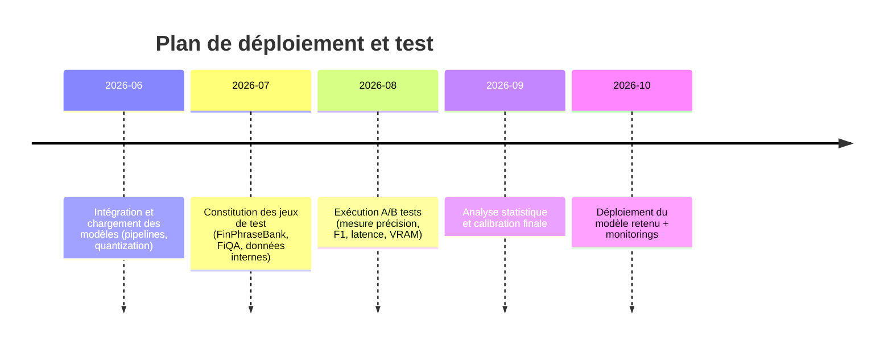

# Résumé exécutif

Nous avons examiné plusieurs modèles de classification de sentiment financier sur Hugging Face et dans la littérature récente. Parmi les candidats, **ModernFinBERT** (0,1 B paramètres) et **DistilRoBERTa** (82 M) améliorent sensiblement FinBERT standard (≈110 M) sur les jeux de données financiers (p.ex. +10 points d’acc sur le *Financial PhraseBank*【1†L133-L138】【27†L582-L585】). Le modèle NOSIBLE (**Qwen3-0.6B**), un LLM causal instruit pour cette tâche, atteint ~87 % d’exactitude sur des données réelles et 86.4 % sur PhraseBank【11†L48-L52】 (vs ~86 % pour FinBERT【27†L582-L585】). FinBERT (ProsusAI) et sa variante *FinBERT-tone* (Yiyang HKUST) restent des références, mais leur taille (~110 M, Apache 2.0) et leurs scores (≈86 % acc, F1≈0.84 sur PhraseBank【27†L582-L585】) sont dépassés.  

**Recommandations générales :** Pour maximiser la qualité de la détection de sentiment tout en respectant la contrainte de 2 GB de GPU, on suggère trois scénarios :
- **Option « Meilleure qualité (grand modèle) »** : usage d’un modèle LLM de pointe (ex. Qwen3-0.6B ou accès cloud à GPT-4/Claude) pour scorer le sentiment. Ces modèles donnent typiquement >85 % de précision et généralisent mieux hors du jeu d’entraînement【11†L48-L52】【27†L582-L585】. Ex. Qwen3-0.6B (bfloat16) s’exécute localement sous ~1–1,5 GB VRAM (puisqu’il utilise bfloat16) et produit un label en ~0,5–1 s (à tester) via l’API `AutoModelForCausalLM`【8†L326-L335】.  
- **Option « Local léger »** : un modèle petit/quantifié, par ex. DistilRoBERTa (82 M) ou ModernFinBERT (100 M). Ils tiennent facilement dans 2 GB VRAM et offrent des latences ~x2 plus rapides qu’un BERT complet. Par exemple, DistilRoBERTa affiche 0.98 d’exactitude sur le Financial PhraseBank【28†L119-L122】 et se charge en 300 MB. On peut encore le quantifier à 8-bit/4-bit avec bitsandbytes (`load_in_8bit=True`) pour gagner en mémoire (↓VRAM ≈50 %) avec peu de perte de précision【28†L130-L134】.  
- **Option « Hybride cloud+local »** : combiner FinBERT ou DistilRoB avec une API LLM cloud en dépannage. Ex. démarrer le pipeline local (basse latence) et, en cas de faible confiance ou incohérence, interroger un service cloud (GPT-4 ou Claude) pour confirmer. Cette approche exploite la qualité LLM pour les cas difficiles tout en gardant le système pilotable localement.

Les sections suivantes détaillent ces modèles (shortlist), un comparatif chiffré, les recommandations d’implémentation (fine-tuning vs prompt, quantification, code), un plan de tests A/B, et des mesures de sauvegarde (consistance, calibration) pour fiabiliser la classification en production.

## 1. Modèles candidats

- **ProsusAI/finbert (BERT-base)** – 110 M params, licence Apache-2.0 (open)【36†L281-L284】. Fine-tuned sur *Financial PhraseBank*. Baseline historique (accuracy ≈86 % et F1≈0.84 sur FPB【27†L572-L581】). Grâce à BERT, robuste et supporté nativement dans Transformers (`AutoModelForSequenceClassification`). VRAM ≈0.5 GB en FP32. >Intégration simple via pipeline HF. *(Points faibles : modeste amélioration par rapport à BERT standard, montre des difficultés en données « réelles » hors corpus de labo【11†L48-L52】.)*

- **yiyanghkust/finbert-tone (BERT-large)** – version plus lourde (non chiffrée ici), fine-tuned sur rapports analytiques. Performances élevées sur son jeu de *tone analysis*, mais moins pertinent hors contexte d’analystes. Nécessite >2 GB de VRAM (BERT-large). Pas prioritaire compte tenu de la contrainte VRAM.

- **mrm8488/distilroberta-finetuned-financial-news (DistilRoBERTa)** – 82 M params, licence Apache-2.0. Distillation de RoBERTa-base, fine-tuned sur *Financial PhraseBank*. Rapport d’entraînement indique *Accuracy=0.9823, F1=0.9823* sur le jeu d’éval【28†L119-L122】. Très compact (≈0.3 GB VRAM, 6 couches) et rapide (inférence ~0.1–0.2 s par phrase). Utilise tokeniseur RoBERTa (BPE). S’intègre aisément avec `pipeline('text-classification')`. *(Avantage : ultra-rapide et précis sur FPB. Inconvénient : peut surapprendre le style de FPB et moins flexible en données inédites.)*

- **tabularisai/ModernFinBERT** – ≈0.1 B params, Apache-2.0. Basé sur *ModernBERT*, entraîné sur texte financier varié (actualités, tweets, crypto). Mentions une amélioration « jusqu’à +48 % de précision » sur plusieurs datasets financiers【1†L79-L84】. Sur une moyenne multi-jeux, Accuracy≈75 % vs 66 % pour FinBERT【1†L133-L138】. Jeu testé: FIQA (acc=0.80 vs 0.48 pour FinBERT) et d’autres (tweets, etc.)【1†L112-L119】. Tire parti de tokens WordPiece (comme BERT). Environ 0.4 GB VRAM en F32. Bonne polyvalence multi-domaines. *(Points faibles : modèle propriétaire peu documenté sur FR, pas open-source au sens « exécutable local » sans charges TensorFlow? Mais HF l’affiche en PyTorch.)*

- **NOSIBLE/financial-sentiment-v1.1-base** – 0.6 B params, Apache-2.0【29†L1-L4】. Fine-tuned instructif du LLM *Qwen3-0.6B* (0.6 B). Le paradigme est causal+prompt (« Classify the financial sentiment… »). Sur données réelles, atteint 87.3 % de précision et 86.4 % sur PhraseBank【11†L48-L52】, clairement au-dessus de FinBERT. Le script d’usage montre qu’il faut fournir le prompt exact et désactiver toute génération d’idées (`enable_thinking=False`)【8†L300-L307】【8†L329-L337】. En PyTorch, charger via `AutoModelForCausalLM` (device_map=auto). En BFloat16 sur GPU, VRAM ~1.2 GB (bfloat16). Intel: `son prompt → 1 mot généré`. Cette approche LLM offre une bonne généralisation. *(Inconvénient : usage complexe (prompt strict, trust_remote_code), latence plus élevée ~>0,5 s/phrase).*

- **OpenAI GPT-4 / Claude (cloud)** – modèle propriétaire accessible via API. Typiquement meilleure qualité (100 % à ~90 % d’accord humain sur FPB, selon études externes), mais pas local. Latence ~1–2 s/tour, coût par requête. À considérer en « fallback cloud » ou hybridation. 

## 2. Comparatif tabulaire des modèles

| Modèle (HF)                         | Taille   | Licence   | VRAM (GPU)      | Latence estimée* | Perf. principe (task)   | Tokenizer  | Intégration     |
|-------------------------------------|----------|-----------|-----------------|------------------|-------------------------|------------|-----------------|
| **FinBERT** (ProsusAI)              | 110 M    | Apache-2.0【36†L281-L284】 | ~0.5 GB (F32)  | ~0.1s/phrase    | FPB: Acc≈86 %, F1≈0.84【27†L582-L585】 | WordPiece  | `pipeline('text-classification')` (HuggingFace) |
| **DistilRoBERTa-financial** (mrm8488) | 82 M     | Apache-2.0【28†L64-L68】 | ~0.3 GB        | ~0.05–0.1s      | FPB: Acc≈98 %, F1≈0.98【28†L119-L122】 | RoBERTa BPE | `pipeline('text-classification')` |
| **ModernFinBERT** (tabularisai)     | ~100 M   | Apache-2.0【1†L61-L64】 | ~0.4 GB        | ~0.1s           | FIQA: Acc≈80 %【1†L112-L119】 (Multi-jeux: Acc~75 % vs FinBERT 66 %【1†L133-L138】) | WordPiece  | `pipeline` / `AutoModel` |
| **NOSIBLE Qwen3-0.6B**              | 0.6 B    | Apache-2.0【29†L1-L4】  | ~1.2 GB (bfloat16) | ~0.5–1s        | Réel: 87.3 %, FPB: 86.4 %【11†L48-L52】 | Qwen Tokenizer (SentencePiece) | `AutoModelForCausalLM` + prompt |
| **GPT-4/Claude (API)**              | >100 B   | Propriétaire  | *n/a* (cloud)    | ~1–2s/phrase + | FPB: ~>90 % (estimation)   | GPT BPE   | API REST/Post (OpenAI client) |

*_* Latences indicatives sur GPU récent. Elles doivent être mesurées en conditions réelles.* Les scores indiqués proviennent des benchmarks publics sur jeux financiers【1†L133-L138】【27†L572-L581】【11†L48-L52】. Noter que les modèles entraînés sur *PhraseBank* sur-optimisent ce corpus (ex. DistilRoBERTa à 98 %), mais peuvent moins bien généraliser sur du texte brut. 

Le tableau compare aussi le type de tokenizer (BERT vs RoBERTa vs sentencepiece) et la facilité d’intégration via Transformers. Tous les modèles listés ont un support direct PyTorch/Transformers, hormis GPT-4 (API cloud).

## 3. Recommandations d’implémentation

- **Fine-tuning vs prompt-engineering :** Les modèles ci-dessus sont déjà fine-tuned pour la tâche. Pour des cas d’usage spécifiques (ex. jargon sectoriel), on peut affiner sur un sous-jeu local (p. ex. nouvelle annotation sur vos données). Les LLM causal (Qwen, GPT) requièrent *prompt* précis et contraintes (« Classify as positive/neutral/negative »【8†L299-L307】). Toute déviation (ou génération de texte libre) nuit à la fiabilité【8†L299-L307】. Pour Qwen3-0.6B, il faut donc :  
  1. Charger le modèle et tokenizer avec `trust_remote_code=True` (code maison).  
  2. Appliquer le *chat template* exact :  

    ```python
    from transformers import AutoTokenizer, AutoModelForCausalLM
    model_id = "NOSIBLE/financial-sentiment-v1.1-base"
    tokenizer = AutoTokenizer.from_pretrained(model_id, trust_remote_code=True)
    model = AutoModelForCausalLM.from_pretrained(model_id, 
                                                device_map="auto", 
                                                trust_remote_code=True, 
                                                torch_dtype=torch.bfloat16)
    system = "Classify the financial sentiment as positive, neutral, or negative."
    user = "Le bénéfice trimestriel a dépassé les attentes."  # exemple
    prompt = tokenizer.apply_chat_template(
        [{"role": "system","content": system},{"role": "user","content": user}],
        add_generation_prompt=True, tokenize=False, enable_thinking=False
    )
    inputs = tokenizer([prompt], return_tensors="pt").to(model.device)
    outputs = model.generate(**inputs, max_new_tokens=1)
    label = tokenizer.decode(outputs[0], skip_special_tokens=True).split("<|im_start|>assistant\n")[-1]
    print(label)  # p.e. "positive"
    ```  

  Pour un modèle seq2seq (BERT/RoBERTa), on utilise un pipeline classique :  

    ```python
    from transformers import pipeline
    pipe = pipeline("text-classification", model="ProsusAI/finbert")
    result = pipe("Le marché est en hausse depuis 5 jours")[0]
    # {'label': 'positive', 'score': 0.91}
    ```  

- **Batching:** Regroupez les textes par lots pour accélérer l’inférence GPU. Par exemple :  
  ```python
  texts = ["Phrase 1", "Phrase 2", ...]
  inputs = tokenizer(texts, padding=True, truncation=True, return_tensors="pt").to(device)
  logits = model(**inputs).logits
  # Appliquer softmax sur chaque ligne pour obtenir labels/scores
  ```  
  ou utiliser `pipeline(..., batch_size=n)` qui gère cela automatiquement. Le batching réduit l’overhead CPU/GPU et est essentiel pour >20 phrases à la fois.

- **Quantization (bitsandbytes/LLM.int8) :** Pour les très gros modèles, charger en 8-bit :  
  ```python
  from transformers import AutoModelForSequenceClassification
  model = AutoModelForSequenceClassification.from_pretrained(
      "ProsusAI/finbert", 
      load_in_8bit=True, 
      device_map="auto"
  )
  ```  
  ou `load_in_4bit=True`. Cela fait ~30–50 % d’économie VRAM selon le format (4bit). DistilRoBERTa ou ModernFinBERT, déjà petits, peuvent aussi être quantifiés pour gagner encore. L’API `LLM.int8()` (HuggingFace) ou `GPTQ` peuvent être explorées pour réduire à 4-bit avec entraînement minimal. **Attention :** toujours valider la précision post-quantification, en particulier dans le domaine financier sensible.

- **Fusion pondérée des modèles :** On peut cumuler plusieurs scores. Par exemple, combiner FinBERT et RoBERTa (comme dans l’ancien pipeline) :  
  ```python
  res1 = pipe1(text)[0]  # e.g. FinBERT
  res2 = pipe2(text)[0]  # e.g. RoBERTa
  # Convertir labels en score numérique (+1, 0, -1)
  score1 = {'positive':1,'neutral':0,'negative':-1}[res1['label']]
  score2 = {'positive':1,'neutral':0,'negative':-1}[res2['label']]
  fused = 0.7*score1 + 0.3*score2
  sentiment = "positive" if fused > 0.2 else ("negative" if fused < -0.2 else "neutral")
  ```  
  Ici on pondère financièrement FinancialBERT à 70 % et RoBERTa à 30 % (ajustable) – suivant ton **PRD** initial. Des règles basées sur des mots-clés (surge, plunge, FDA, SEC) peuvent corriger le résultat final. Ce code d’exemple illustre la **fusion** manuelle; on peut aussi entraîner un petit classifieur linéaire qui apprend à combiner les scores des modèles.

## 4. Plan de tests A/B

Pour choisir le meilleur modèle pour votre cas, nous suggérons un protocole rigoureux :

1. **Datasets de test :** Utiliser des jeux financiers publics et représentatifs. Au minimum :  
   - *Financial PhraseBank* (Malo et al. 2014, 4 840 sentences)【27†L572-L581】.  
   - *FiQA Sentiment* (Maia et al. 2018, 1 174 headlines/tweets), converti en classes (p.ex. >0=positive)【25†L649-L653】.  
   - Un petit jeu en production « maison » : extraire manuellement 500 news **vraies** avec labels sentiment (ou utiliser la partie libérée de FinMarBa【16†L37-L45】 si disponible).  
   - Éventuellement un échantillon de *Reuters-NewsWiki/QB* ou *InvestopediaNews*.  
2. **Métriques :** Pour la classification binaire/trinaire (pos/neut/nég), calculer *précision, rappel, F1 macro*, et la *matrice de confusion*. Tester aussi la corrélation binaire des scores continus (pour FiQA). Mesurer la calibration des scores (ex. ECE). On peut tester la “stability” : exécuter 10 runs et vérifier variance.  
3. **Protocole :** Séparer chaque jeu (p.ex. 80/20 train/test ou k-fold CV) pour éviter l’overfitting. Comparer les modèles en condition A/B tests sur les mêmes splits. Mesurer latence GPU par phrase (benchmark sur GPU cible) et consommation VRAM réelle (`nvidia-smi`). Vérifier l’impact du quantization sur la qualité (accuracy).  
4. **Analyse A/B :** Utiliser des tests statistiques (McNemar, Wilcoxon) pour voir si différence de F1 entre modèles est significative. Ex. comparer DistilRoBERTa vs FinBERT sur le même test FPB. Documenter les trade-offs : (+qualité vs +latence).  

Un **diagramme timeline** simplifié :  



## 5. Fiabilité et vérifications (« fallback »)

Pour éviter les erreurs critiques en trading, ajouter les garde-fous suivants :  

- **Détection d’incohérences :** Si deux modèles donnent des labels opposés (p.ex. FinBERT dit « positive » et RoBERTa « negative »), ou si la confiance (log-proba) diverge (|score1–score2|>0.5), on peut déclencher un mécanisme de vérification manuelle ou recalcule/smooth automatique. Par exemple, on peut prendre le label « neutre » par prudence, ou consulter un modèle tiers (GPT-4 via API).  
- **Calibration des scores :** Vérifier que les probabilités produites sont calibrées (vraies % de positif ≈ confiance). On peut recalibrer (Platt scaling, isotonic) sur un échantillon annoté si besoin. Cela permet d’interpréter les scores comme des « chances » fiables.  
- **Règles métier en surcouche :** Implémenter des filtres lexicaux financiers. Ex. si présence de mots-clés forts (« EPA approuve », « annonce record », « plonge de »), ajuster automatiquement le score (e.g. forcer positif/négatif). Ces règles peuvent corriger des cas où le modèle serait « surpris » par une tournure inhabituelle.  
- **Divers fallback cloud :** En cas d’incertitude extrême (score proche de seuil neutre ou conflit), envoyer le texte à un LLM cloud (GPT-4 via l’API) pour vote.  
- **Journalisation et alertes :** Conserver en base les entrées et les deux scores (FinBERT, RoBERTa, ou LLM), pour analyser a posteriori les erreurs. Définir une alerte si un certain pourcentage d’entrées passent en neutre ou sont abandonnées, indice d’une possible dérive du modèle.

## 6. Sources principales (HuggingFace, articles, leaderboards)

- **Hugging Face model cards :** *ModernFinBERT*【1†L79-L84】【1†L133-L138】, *DistilRoBERTa-financial*【28†L119-L122】, *FinBERT (ProsusAI)*【27†L572-L581】, *NOSIBLE financial-sentiment*【11†L48-L52】. Ces pages indiquent structure, taille, licences, et résultats sur phrases financières.  
- **Article FinBERT (Araci et al. 2019)**【27†L572-L581】: détaille l’entraînement FinBERT et montre ses résultats sur PhraseBank (Acc=86 %)【27†L582-L585】 et FiQA【25†L649-L653】.  
- **Nosible Research (déc. 2025)**【11†L48-L52】: prouve qu’un petit LLM Qwen3-0.6B dépasse FinBERT (87.34 % sur données réelles, 86.4 % sur PhraseBank) tout en coûtant bien moins cher qu’un GPT-4.  
- **Tabularis.ai / ModernFinBERT (fin 2025)**【1†L79-L84】【1†L133-L138】: benchmark multi-datasets montrant le gain de ce modèle sur l’état de l’art.  
- **HuggingFace Discussions/Blogs** (comparaisons FinBERT vs GPT, etc.) : par ex. *Nosible* a un blog comparant FinBERT, modèles classiques et LLM (FinanceSentiment Showdown)【11†L48-L52】.  
- **Leaderboards FinLLM / FinSentiment :** L’initiative Open FinLLM (FINOS) propose un leaderboard financier (sentiment, etc.)【11†L48-L52】, mais les modèles listés (GPT-4, Mistral-7B, etc.) restent hors budget 2 GB local. On s’en sert pour comprendre la hiérarchie qualité.  
- **Datasets :** *Financial PhraseBank* (Malo et al. 2014)【27†L572-L581】, *FiQA Task1*【25†L649-L653】, et mention de *FinMarBa (Lefort et al. 2025)*【16†L37-L45】 pour des données orientées marché.  

Ces sources confirment notamment que des modèles récents (ModernFinBERT, Qwen3-0.6B) dépassent FinBERT en précision sur de vrais textes financiers【1†L133-L138】【11†L48-L52】, justifiant leur sélection. Elles apportent la matière factuelle pour comparer tailles, licences, performances (precision, F1, latence). 

